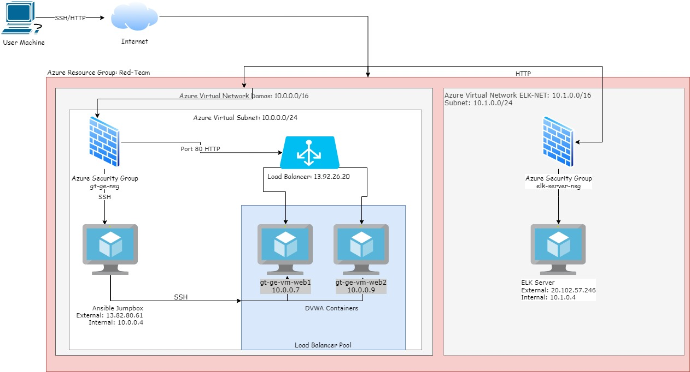
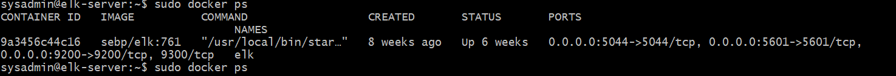
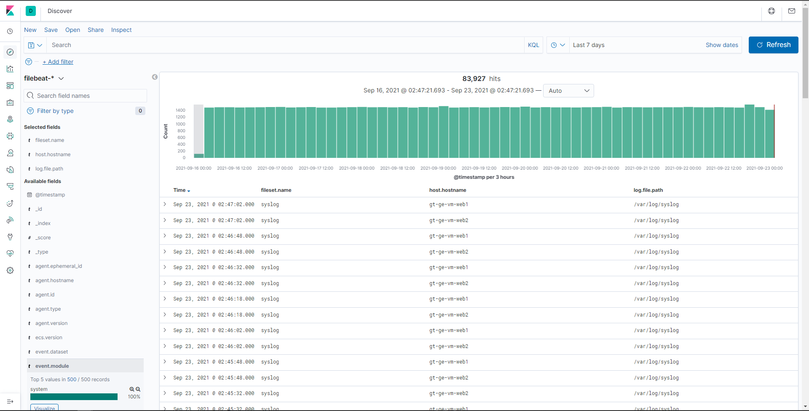
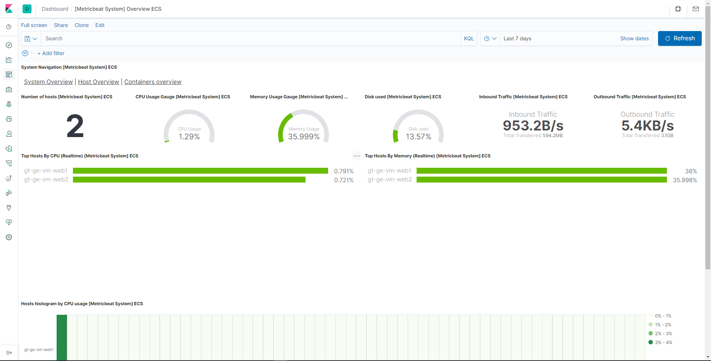

## Automated ELK Stack Deployment

The files in this repository were used to configure the network depicted below.  

These files have been tested and used to generate a live ELK deployment on Azure. They can be used to either recreate the entire deployment pictured above. Alternatively, select portions of the **pentest.yml** file may be used to install only certain pieces of it, such as Filebeat.

  - [Pentest File](https://github.com/halotx3/week-13-project/blob/main/Ansible/pentest.yml)

This document contains the following details:
- Description of the Topology
- Access Policies
- ELK Configuration
  - Beats in Use
  - Machines Being Monitored
- How to Use the Ansible Build

### Description of the Topology

The main purpose of this network is to expose a load-balanced and monitored instance of DVWA, the D*mn Vulnerable Web Application.

Load balancing ensures that the application will be highly **avalible & reliable**, in addition to restricting **access** to the network.
- _What aspect of security do load balancers protect? What is the advantage of a jump box?_
    + Load balancers protect the avaliblity & stability of the application, speading any load across all the VMs as well as ensuring the application will remain up in the event of one VM going down.
    + The advantage of a jump box is that it is an access point from which you can access the other VMs from. This allows a more secure structure and the ablity to coordinate multiple machines from one.

Integrating an ELK server allows users to easily monitor the vulnerable VMs for changes to the _____ and system _____.
- _What does Filebeat watch for?_
    + FileBeat watches for interactions with files and the file system such as when a directory and file was accessed.
- _What does Metricbeat record?_
    + Metricbeat records the metrics and stats of the system and any services running on said system.

The configuration details of each machine may be found below.

| Name    | Function          | IP Address | Operating System |
|---------|-------------------|------------|------------------|
| Jumpbox | Gateway           | 10.0.0.4   | Linux            |
| Web1    | Webserver         | 10.0.0.7   | Linux            |
| web2    | Webserver         | 10.0.0.9   | Linux            |
| Elk     | Monitoring Server | 10.1.0.4   | Linux            |

### Access Policies

The machines on the internal network are not exposed to the public Internet. 

Only the **jumpbox** machine can accept connections from the Internet. Access to this machine is only allowed from the following IP addresses:
- _Add whitelisted IP addresses_
    + xx.xx.xxx.197 || Personal IP Address

Machines within the network can only be accessed by **the jumpbox**.
- _Which machine did you allow to access your ELK VM? What was its IP address?_
    + The machine that accesses the ELK VM is the jumpbox, with an IP of 10.0.0.4.

A summary of the access policies in place can be found in the table below.

| Name    | Publicly Accessible  | Allowed IP Address         |
|---------|----------------------|----------------------------|
| Jumpbox | Yes                  | 10.0.0.7/10.0.0.9/10.1.0.4 |
| Web1    | No                   | 10.0.0.4                   |
| web2    | No                   | 10.0.0.4                   |
| Elk     | No                   | 10.0.0.4                   |

### Elk Configuration

Ansible was used to automate configuration of the ELK machine. No configuration was performed manually, which is advantageous because...
- _What is the main advantage of automating configuration with Ansible?_
    + The main advantage is the ablity to configure multiple machines simutaneously with the desired configuration.

The playbook implements the following tasks:
- _Explain the steps of the ELK installation play. E.g., install Docker; download image; etc._
- Add the private ip of the Elk VM to the Ansible `hosts` file and a separate section called `[elk]` similar to `[webservers]`
- Create an Ansible playbook with the [Install Elk Yml file] which include:
  + Identify the hosts where the configuration is to be applied to the `[elk]` section
  + Installation of Docker
  + Installation of pip3
  + Install the Docker python module
    + Make include the restart the policy `restart_policy: always` This ensures the docker module will start when the server starts
  + Download & launch docker to the elk container w/ specific ports
  + Enable the service docker to boot  

The following screenshot displays the result of running `docker ps` after successfully configuring the ELK instance.  

### Target Machines & Beats
This ELK server is configured to monitor the following machines:
- _List the IP addresses of the machines you are monitoring_
    + The server is configured to monitor both 10.0.0.7 & 10.0.0.9 

We have installed the following Beats on these machines:
- _Specify which Beats you successfully installed_
    + Both Filebeat and Metricbeat were installed on the machines in question.

These Beats allow us to collect the following information from each machine:
- _In 1-2 sentences, explain what kind of data each beat collects, and provide 1 example of what you expect to see. E.g., `Winlogbeat` collects Windows logs, which we use to track user logon events, etc._
    + As seen in the image below, filebeat allows us to see events related to files being accessed providing additional information such as the file name and path as well as the host it occured on.

    + Metricbeat provides monitoring of both system statiscics like cpu and memory usage as well as providing other bits of system information. It can also montitor the usage of services running on the system.

### Using the Playbook
In order to use the playbook, you will need to have an Ansible control node already configured. Assuming you have such a control node provisioned: 

SSH into the control node and follow the steps below:
- Copy both of the **playbook** files to the `/etc/anisble` folder on the **anisble container**.
- Update the **hosts** file to include **the collection group and the host it should be installed on**
- Run the playbook, and navigate to **the kibana url** to check that the installation worked as expected.

- _Which file is the playbook? Where do you copy it?_
  + [filebeat-playbook](Ansible/filebeat-playbook.yml)
  + [metricbeat-playbook](Ansible/metricbeat-playbook.yml)
  + `/etc/ansible/` is where you copy the playbook

- _Which file do you update to make Ansible run the playbook on a specific machine? How do I specify which machine to install the ELK server on versus which to install Filebeat on?_
  + The `hosts` file in `/etc/ansible/` is the file that would be updated for install on specific machines.
- _Which URL do you navigate to in order to check that the ELK server is running?
    + http://xx.xxx.xx.246:5601/app/kibana

_As a **Bonus**, provide the specific commands the user will need to run to download the playbook, update the files, etc._
